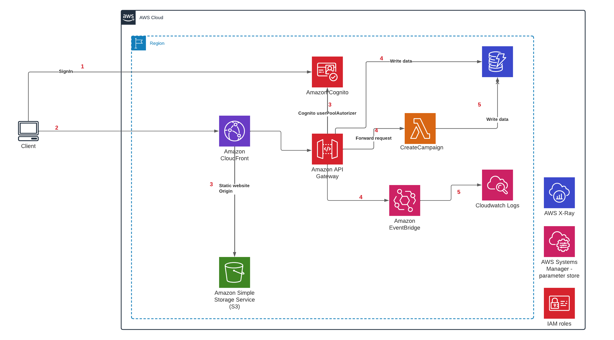

### POC AWS CDK TypeScript project!

# Target architecture

## Components list 
- SSO: Amazon cognito `backend/src/support/sso`
  - User pool
  - Oauth2 client that support code grant & implicit flows
- Backend
  - ApiGateway
    - validate JWT token using Cognito userPoolAutorizer 
    - validates request payload before forward req to lambda or EventBridge 
    - transform payload and proxy to dynamodb PutItem (we don't need anymore to use lambda behind the gateway to write into dynamodb)
  - Create campaign function with a mounted lambda layer (`backend/src/core/LambdaLayersStack.ts`) that contain yup library
  - EventBridge event bus + EventBridge rule that log event data to cloud watch
  - SSM parameter store: used to store lambda layer ARN then referenced in `backend/src/core/MicroserviceStack.ts` abstract class to be mounted inside any function that inherit from the abstract class 

## How to deploy

 * `cdk deploy lambda-layers`   first deploy lambda layers , layers ARN is stored in SSM then referenced by the lambda Stack on creation
 * `cdk deploy --all`   then deploy all
 

